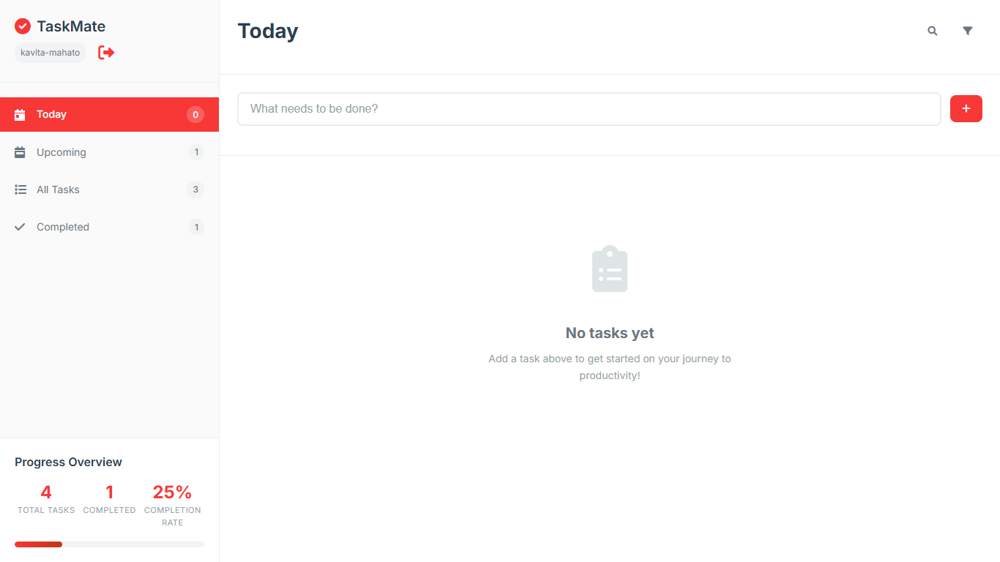

# 📋 TaskMate - Modern Task Management

<div align="center">
  
  
  
  
</div>

<div align="center">
  <h3>🚀 A beautiful, intuitive, and feature-rich task management application</h3>
  <p>Stay organized, boost productivity, and achieve your goals with TaskMate's modern interface and powerful features.</p>
</div>

---

## ✨ Features

### 🎯 **Core Functionality**
- **📝 Task Creation**: Add tasks with detailed information including due dates, priorities, and project categories
- **✅ Task Management**: Mark tasks as complete, edit existing tasks, or delete them
- **📅 Smart Views**: Organize tasks by Today, Upcoming, All Tasks, and Completed
- **🔍 Advanced Search**: Find tasks quickly with real-time search functionality
- **🏷️ Project Categories**: Organize tasks into Personal, Work, Shopping, and Health projects

### 🎨 **User Experience**
- **📱 Responsive Design**: Works seamlessly on desktop, tablet, and mobile devices
- **🎨 Modern UI**: Clean, professional interface with smooth animations
- **⌨️ Keyboard Shortcuts**: Power user features with Ctrl+K for search, Ctrl+N for new tasks
- **📊 Progress Tracking**: Visual progress indicators and completion statistics
- **🔔 Smart Notifications**: Real-time feedback for all actions

### 🚀 **Advanced Features**
- **📈 Progress Analytics**: Track completion rates and productivity metrics
- **🎯 Priority System**: Four-level priority system (Low, Medium, High, Urgent)
- **📅 Due Date Management**: Smart due date handling with overdue indicators
- **💾 Local Storage**: All data persists locally in your browser
- **📤 Data Export/Import**: Backup and restore your tasks
- **🎭 Empty States**: Beautiful empty state designs to guide new users

---

## 🖼️ Screenshots

<div align="center">
  
  <p><em>Clean, modern interface with sidebar navigation and task management</em></p>
</div>

---

## 🚀 Quick Start

### Prerequisites
- A modern web browser (Chrome, Firefox, Safari, Edge)
- No additional software or dependencies required!

### Installation

1. **Clone the repository**
   ```bash
   git clone https://github.com/kavita-mahato/Task_Manager.git
   cd Task_Manager
   ```

2. **Open the application**
   ```bash
   # Simply open index.html in your browser
   open index.html
   # or double-click the index.html file
   ```

3. **Start managing your tasks!**
   - Add your first task using the input field
   - Set due dates, priorities, and project categories
   - Use the sidebar to navigate between different views

---

## 🎮 Usage Guide

### Adding Tasks
1. Click on the task input field
2. Type your task description
3. Click the `+` button or press `Enter` to expand task details
4. Set due date, priority level, and project category
5. Click "Add Task" to save

### Managing Tasks
- **Complete**: Click the circular checkbox next to any task
- **Edit**: Click the edit icon (pencil) on any task
- **Delete**: Click the delete icon (trash) on any task
- **Search**: Click the search icon or press `Ctrl+K`

### Navigation
- **Today**: View tasks due today or overdue
- **Upcoming**: View tasks with future due dates
- **All Tasks**: View all incomplete tasks
- **Completed**: View all completed tasks

---

## 🛠️ Technical Details

### Architecture
- **Frontend**: Pure HTML5, CSS3, and JavaScript (ES6+)
- **Storage**: Browser LocalStorage for data persistence
- **Styling**: CSS Custom Properties (CSS Variables) for theming
- **Icons**: Font Awesome 6.0 for beautiful icons
- **Fonts**: Inter font family for modern typography

### File Structure
```
task-manager/
├── index.html          # Main HTML structure
├── styles.css          # Complete CSS styling and animations
├── script.js           # JavaScript application logic
└── README.md           # Project documentation
```

### Key Components
- **TaskManager Class**: Main application controller
- **Local Storage**: Automatic data persistence
- **Responsive Design**: Mobile-first approach
- **Event Handling**: Comprehensive user interaction management
- **Data Management**: CRUD operations for tasks

---

## 🎨 Customization

### Color Scheme
The application uses CSS custom properties for easy theming:

```css
:root {
    --primary-color: #fd5757;      /* Main brand color */
    --primary-hover: #c23616;      /* Hover state */
    --success-color: #28a745;       /* Success states */
    --warning-color: #ffc107;       /* Warning states */
    --danger-color: #dc3545;        /* Error states */
    /* ... more variables */
}
```

### Adding New Project Categories
Edit the project select options in `index.html`:

```html
<select id="task-project">
    <option value="personal">Personal</option>
    <option value="work">Work</option>
    <option value="shopping">Shopping</option>
    <option value="health">Health</option>
    <!-- Add your custom categories here -->
</select>
```

---

## 📱 Browser Support

| Browser | Version | Support |
|---------|---------|---------|
| Chrome | 60+ | ✅ Full Support |
| Firefox | 55+ | ✅ Full Support |
| Safari | 12+ | ✅ Full Support |
| Edge | 79+ | ✅ Full Support |

---

## 🤝 Contributing

Open to contributions! Here's how you can help:

1. **Fork the repository**
2. **Create a feature branch**: `git checkout -b feature/amazing-feature`
3. **Commit your changes**: `git commit -m 'Add amazing feature'`
4. **Push to the branch**: `git push origin feature/amazing-feature`
5. **Open a Pull Request**

### Development Guidelines
- Follow the existing code style
- Test your changes across different browsers
- Update documentation for new features
- Ensure responsive design compatibility


---

## 🙏 Acknowledgments

- **Font Awesome** for the beautiful icons
- **Google Fonts** for the Inter font family
- **Modern CSS** techniques for responsive design
- **ES6+ JavaScript** for clean, maintainable code

---

## 📞 Support

If you encounter any issues or have questions:

- 🐛 **Report Bugs**: [Create an issue](https://github.com/kavita-mahato/Task_Manager/issues)
- 💡 **Feature Requests**: [Start a discussion](https://github.com/kavita-mahato/Task_Manager/discussions)
- 📧 **Contact**: [kavitamahato0835@gmail.com](mailto:kavitamahato0835@gmail.com)

---

<div align="center">
  <p><strong>TaskMate</strong> - Your productivity companion</p>
  <p>Made with ❤️ and lots of ☕ by Kavita Mahato</p>
</div>